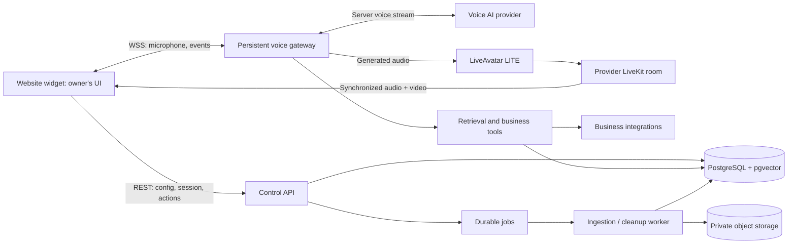

# Voice Avatar Support Platform — System Design

Implementation handoff • 4 October 2026 • Backend and UI integration contracts

> Rendering direction updated: the owner prefers an animator we operate. Read [ANIMATION_ALTERNATIVES.md](ANIMATION_ALTERNATIVES.md) first. Treat the LiveAvatar integration below as an optional adapter/reference, not the selected production renderer. Phase 0 now benchmarks self-hosted models and validates licensing before committing to a renderer. Keep the API, tenancy, knowledge, action, and UI contract design.

## 1. Product and scope

Build a multi-tenant service that businesses embed on their websites. Visitors speak to a realistic avatar that answers questions using business knowledge and invokes approved business tools. LiveAvatar renders the character. Our backend owns conversation policy, knowledge, integrations, permissions, session lifecycle, and usage accounting.

The product owner builds the visual UI. The implementation agent builds the backend and a headless browser integration SDK. Do not build a dashboard or style the widget. Supply schemas, sample payloads, and a minimal test harness so the UI can be developed independently.

### First release

- Voice conversations with a configurable avatar and voice.
- Business website/document ingestion, grounded answers, and source links.
- Support ticket creation and a human contact/handoff option.
- Tenant administration APIs: agents, sources, allowed domains, avatars, integrations, limits, session history.
- Usage limits and a transparent development mode.
- One complete support vertical first: website/document support plus ticket creation. Restaurant reservations and shopping use the same tool boundary and are later connector modules.

### Deferred capabilities

- Automated purchases, refunds, payments, cancellations, and arbitrary browser automation.
- Fully automated custom-avatar training onboarding.
- Phone calls, persistent cross-session visitor memory, mobile-native clients.
- Our own rendering engine, GPU hosting, or custom lip-sync models.

A website purchase flow can later recommend products, propose cart changes, and open the merchant's normal checkout. Card details never enter the voice model.

## 2. Architectural decisions

| Decision | Choice | Reason |
|---|---|---|
| Main language | TypeScript on Node.js LTS | Shared schemas and browser SDK |
| API | Fastify REST, OpenAPI, Zod validation | Small modular backend |
| Live voice | Server-owned OpenAI voice connection behind an adapter | Keeps policy, credentials, and tool execution server-side |
| Avatar | LiveAvatar LITE behind an adapter | Independent voice and rendering choices |
| Browser media | LiveKit client joins provider room | Receives synchronized avatar audio/video |
| Database | PostgreSQL with pgvector | Tenant data, jobs, usage ledger, retrieval |
| Background work | PostgreSQL-backed durable job queue | Avoid extra infrastructure at pilot scale |
| File storage | Private S3-compatible object storage | Source documents and approved avatar portraits |
| Authentication | Managed OIDC; API validates tokens | Avoid custom password/session implementation |
| Runtime | Container API, persistent gateway, worker | Live sockets need a persistent process |
| Validation modes | mock, provider sandbox, live | Minimize paid development sessions |

No Kubernetes, dedicated vector database, Redis, or GPU cluster is required for the pilot. Add Redis only when distributed rate limiting or routing needs justify it. Use a managed PostgreSQL service with backups and supported extensions.

Exact voice models and SDK versions are configuration, verified during the first integration spike. The official demo uses GPT-Live; do not assume this account has access. Do not combine GPT-Live events with the separate Realtime API event protocol. Implement ONE accessible voice protocol first.

## 3. Ownership and topology



We operate API, gateway, worker, database, and storage. The owner's frontend is hosted separately. LiveAvatar operates rendering and its media service; OpenAI operates voice inference. No local LiveAvatar rendering engine is installed.

At pilot scale use one gateway instance. The API allocates every session to an owner instance. With multiple gateways, return that instance's routable WSS endpoint or use routing that pins the session to its owner. A generic load balancer without session ownership will break this design.

## 4. Main modules and repository layout

```text
apps/
  api/                 tenant/admin APIs, visitor bootstrap, session allocation
  gateway/             socket transport, voice/avatar bridge, lifecycle
  worker/              ingestion, expiry, reconciliation, cleanup
packages/
  contracts/           Zod schemas, OpenAPI, event definitions
  browser-sdk/         headless microphone/media/session integration
  domain/              tenancy, agents, conversations, tools, quotas
  persistence/         migrations, repositories, job queue
  providers/           liveavatar, openai voice, mock adapters
  connectors/          support ticket adapter; later commerce/reservations
  telemetry/           metrics, structured logging, redaction
tests/
  integration/         tenant isolation, lifecycle, tool actions, usage
  fixtures/            recorded protocol events, knowledge corpus
infra/
  compose.yaml         local API/gateway/worker/Postgres/storage
  deploy/              container manifests and deployment notes
```

Keep provider wire events inside adapters. Browser events and business tools must not depend on a particular voice model's event names.

## 5. Session startup and shutdown

### Startup

1. UI displays portrait/config without opening a billable provider session.
2. Visitor presses Start, accepts the microphone/AI disclosure, and grants microphone permission. Check media prerequisites before creating a provider session.
3. Obtain a short-lived visitor credential scoped to deployment and permitted origin. A public deployment key is an identifier, not a secret.
4. POST a session request with an idempotency key. API resolves tenant and agent server-side, checks abuse controls, credits, concurrency, and atomically reserves the initial usage allowance.
5. Allocate a gateway owner and create a session record in ALLOCATED state. Return only its WSS URL and a short-lived session ticket; providers are not started yet.
6. SDK opens WSS and authenticates with a ticket as its first message within five seconds. Keep credentials out of URL query strings and logs. Gateway checks Origin and ticket scope and consumes its nonce once.
7. Gateway opens voice and avatar connections with bounded startup timeouts. In LITE, create/start the avatar server-side and keep its provider session token and media websocket URL private.
8. Wait for avatar readiness, send room-scoped credentials to SDK, and join LiveKit as a subscriber. SDK acknowledges attached media and successful playback. Autoplay blocking must produce a UI prompt, not silent failure.
9. On all legs ready, send session.ready and begin microphone forwarding and greeting. No greeting audio is forwarded before the avatar accepts commands.
10. If any step fails, close every created provider leg, release unused reservation, and return a stable public error code.

### Lifecycle

```text
ALLOCATED -> CONNECTING -> ACTIVE -> STOPPING -> ENDED
                    \-> STOPPING -> FAILED
```

Conversation status is separate: idle, listening, thinking, speaking, waiting_for_confirmation. Generated audio is not proof that playback is speaking; use renderer/media events for UI status.

### Shutdown rules

- End on explicit stop, duration limit, exhausted allowance, idle policy, browser transport loss, or fatal provider/media failure.
- Pilot disconnect behavior: stop upstream immediately. Restart requires a new session; do not promise seamless resume.
- Closing a tab is best effort only; server timers and reconciliation must finish cleanup.
- One idempotent teardown routine closes voice input/generation, interrupts stale avatar audio, stops avatar session, closes sockets, writes final state, and releases unused reservation. Explicit stop favors prompt silence over draining speech.
- Retry upstream stop with bounded exponential backoff; persist uncertain cleanup and let the worker reconcile it.
- Gateway heartbeat leases plus a worker sweep discover sessions orphaned by process crashes. Persist provider identifiers as soon as they exist.
- Shutdown deployment drains: reject new allocations, stop active sessions within a bounded window, then exit.

## 6. Audio and lip-sync bridge

The normal path is microphone -> gateway -> voice provider -> gateway -> avatar -> provider room -> browser. The browser must not separately play generated voice audio while video arrives later.

Provider-specific requirements, verified against LiveAvatar documentation:

- LITE accepts base64 PCM16, 24 kHz, mono audio through its returned websocket.
- Wait for session.state_updated = connected before sending commands.
- Use agent.speak, agent.speak_end, and agent.interrupt according to the selected voice adapter's turn model.
- agent.interrupt clears pending audio and video. Speaking lifecycle events identify utterances.

[LiveAvatar LITE events](https://docs.liveavatar.com/docs/lite-mode/events)

Implementation rules:

- Browser SDK uses AudioWorklet capture, echo cancellation and noise suppression where available, and explicit resampling to the negotiated format. Do not feed WebM/Opus blobs into a PCM endpoint.
- App transport carries binary PCM input frames, not JSON base64. Negotiate sample rate/channels first; reject invalid size, format, sequence, or excessive traffic. Target capture packets of 20–40 ms and a bounded jitter queue.
- For turn-based voice output, group samples without loss, seal the utterance on output completion, and discard stale output after cancellation. For a continuous GPT-Live stream, follow its separate streaming contract; do not fabricate per-turn boundaries from arbitrary audio chunks.
- Audio reframing preserves samples and order. Start with the renderer's documented chunk recommendation; benchmark any smaller chunks for latency and reliability.
- Keep bounded outbound queues, socket buffered-byte caps, and generation identifiers. Cancel a response if its backlog exceeds the configured duration budget; never let speech accumulate without limit.
- On confirmed interruption: cancel voice generation, invalidate the generation ID, clear avatar buffers, and mark the unheard transcript tail interrupted. For APIs requiring playback-history truncation, truncate to the best estimate of actually heard audio, not generated duration.
- Acknowledgments such as 'mm-hmm' must not automatically cancel the response. Let the selected voice protocol distinguish interruption/backchannel where supported; expose push-to-talk as a fallback.
- Draft transcript arrival can precede audible speech. MVP captions are approximate; do not label them word-synchronized. Log generated versus playback timing separately.
- A voice-only mode is an explicit visitor/product choice and ends the avatar session. Do not silently downgrade video quality or keep rendering in the background.

### Voice adapter contract

Normalized commands: connect(config), appendInputAudio(frame), submitToolResult(callId,result), cancelResponse(responseId), close().

Normalized events: ready, inputTranscript, outputTranscript, outputAudio, toolRequested, responseCompleted, interruptionConfirmed, usageUpdated, error, closed. Preserve provider event IDs, response IDs, timestamps, and capability flags.

The official reference demonstrates a server-owned voice-to-avatar bridge, but is not a production platform. Its GPT-Live continuous-stream semantics differ from classic Realtime turns. [Reference repository](https://github.com/heygen-com/liveavatar-gpt-live-demos)

OpenAI supports server-side voice streams and backend tool handling. Verify the chosen endpoint, model access, audio formats, SDK version, and cancellation semantics before coding the adapter. [Official OpenAI WebSocket documentation](https://developers.openai.com/api/docs/guides/voice-websockets)

## 7. Knowledge pipeline

1. Owner submits an approved URL, text, or uploaded document.
2. Worker downloads/parses with file size, page count, duration, and content-type limits. Website crawling stays within approved hosts and page budgets.
3. Block private/local/link-local addresses, metadata endpoints, redirects to forbidden networks, and DNS rebinding. Run parsers in constrained processes. Treat HTML, documents, and retrieved text as untrusted data.
4. Normalize text; preserve headings, source URL, page number, updated time, and document version. Deduplicate by content hash.
5. Create heading-aware chunks, generate embeddings, and index by tenant + agent + published knowledge version.
6. Publish a completed version atomically. Failed jobs cannot replace the last usable version.
7. search_knowledge retrieves with enforced tenant filters and combines vector similarity with keyword search. Return compact excerpts with source IDs/links; tune result count using an evaluation corpus.
8. The agent answers from returned evidence. If evidence is missing or conflicting, ask a useful question or offer human contact. Do not guess stock, prices, reservation availability, or account status.

Policies and static product information belong in retrieval. Live prices, orders, menu availability, and reservation slots come from connector tools. A embedding similarity score is not a calibrated probability of correctness.

Tenant administration controls source refresh and deletion. Deletion removes chunks, private objects, and related caches. Never load an entire website into each voice prompt.

## 8. Business tools and confirmations

Tools are registered server-side with input/output schemas, permission category, timeout, connector, and idempotency behavior. The model requests a tool; deterministic backend code authorizes and executes it.

| Tool | Release | Permission |
|---|---|---|
| search_knowledge | MVP | Tenant-scoped read |
| get_business_details | MVP | Public read |
| propose_support_ticket | MVP | Prepare action only |
| create_support_ticket | MVP | Execute confirmed action |
| request_human_handoff | MVP | Display contact/escalation or confirmed ticket |
| search_products / get_product | Later | Public catalog read |
| propose_cart_change / apply_cart_change | Later | Visitor cart authorization + confirmation |
| get_reservation_slots / book_reservation | Later | Availability read / confirmed write |

### Durable action flow

1. Model proposes structured action parameters.
2. Backend validates tenant, visitor authorization, schema, connector capabilities, and resource ownership.
3. Store a pending action containing canonical arguments and an expiry; emit action.proposed with a reviewable summary.
4. MVP confirmation is a UI click tied to the authenticated session. Verbal-only confirmation is deferred until independently tested.
5. Confirmation references action ID, not browser-supplied replacements for arguments. Recheck policy and live availability, then execute with an idempotency key.
6. Persist external reference and result. Speak success only after confirmed connector success. For uncertain timeouts, reconcile rather than retry a potentially completed write blindly.

The agent may not invent ticket/booking/order numbers. Tools do not accept arbitrary URLs or tenant IDs from the model. Identity-sensitive order/account tools require real visitor authentication, not a spoken name or email alone. Handoff claims must reflect the actual integration: opening a ticket is not connecting a live human.

## 9. Data model

All tenant-owned tables include tenant_id. Use composite foreign keys where appropriate and PostgreSQL row-level security as defense in depth. Tenant context must be set transaction-locally so pooled connections cannot leak it.

| Table | Important fields |
|---|---|
| tenants | id, status, timezone, limits, retention_policy |
| memberships | tenant_id, user_subject, role |
| agents | id, tenant_id, name, active_version_id |
| agent_versions | id, tenant_id, persona, tool_policy, voice_config, avatar_id, knowledge_version |
| deployments | id, tenant_id, agent_id, public_key, allowed_origins, status |
| avatars | id, tenant_id, provider, provider_avatar_id, portrait_key, status |
| sources / source_versions | tenant_id, agent_id, URI/object_key, checksum, status, metadata |
| knowledge_chunks | tenant_id, agent_id, version, text, embedding, source_ref |
| integrations | tenant_id, type, encrypted_credential_ref, permissions, status |
| sessions | tenant_id, visitor_id, agent_version_id, owner_id, state, mode, provider_ids, times, end_reason |
| transcript_segments | tenant_id, session_id, speaker, text, generation_id, timing, interrupted |
| tool_calls | tenant_id, session_id, call_id, name, redacted_args, state, duration |
| actions | tenant_id, session_id, type, canonical_args, state, expires_at, external_ref |
| usage_reservations | tenant_id, session_id, units_reserved, units_consumed, released_at |
| usage_events | tenant_id, session_id, unique_event_key, meter, units, estimated_cost, price_version |
| audit_events | tenant_id, actor, action, target, time, redacted_metadata |
| jobs | tenant_id, kind, payload_ref, attempt, run_after, lease, status |

Store money in integer minor units or decimal database types, never floating point. Usage units can be milliseconds, provider credits, and model token counts. Separate measurements, cost estimates, and customer billable quantities.

Agent/knowledge versions are immutable for a session. Edits take effect on the next session. Avoid raw audio/video recording by default. Make transcript retention configurable; redact sensitive fields in telemetry. No raw credentials in database logs, exports, or client payloads.

## 10. REST contract for the owner's UI

Version all routes under /v1. Return request_id and stable error codes. Validate with shared Zod schemas and generate OpenAPI. Admin endpoints require tenant membership; public endpoints require constrained visitor/session authorization.

| Endpoint | Purpose |
|---|---|
| GET /v1/widget-config?deployment_key=... | Public branding, portrait, supported features, disclosure, limits |
| POST /v1/visitor-tokens | Short-lived deployment/origin-scoped visitor credential |
| POST /v1/sessions | Idempotent allocation; no provider start until socket attaches |
| GET /v1/sessions/:id | Authorized status and summary |
| POST /v1/sessions/:id/stop | Idempotent teardown |
| POST /v1/sessions/:id/actions/:actionId/confirm | Authorize canonical pending action |
| POST /v1/sessions/:id/actions/:actionId/reject | Reject pending action |
| GET/POST/PATCH /v1/admin/agents | Tenant agent configuration and publish |
| GET/POST/DELETE /v1/admin/sources | Ingest approved knowledge sources |
| GET /v1/admin/jobs/:id | Ingestion status/errors |
| GET/POST/PATCH /v1/admin/deployments | Deployment origins and settings |
| GET/POST/PATCH /v1/admin/avatars | Map approved provider avatars to tenant |
| GET/POST/DELETE /v1/admin/integrations | Connector credentials/capabilities |
| GET /v1/admin/usage | Actual usage, estimates, allowance, reservations |
| GET /v1/admin/sessions | Paginated authorized session history |

Example session allocation:

```json
{
  "session_id": "ses_123",
  "state": "allocated",
  "transport": {
    "url": "wss://gateway.example.com/v1/stream",
    "ticket": "short-lived-one-use-ticket",
    "expires_at": "2026-10-04T12:01:00Z"
  },
  "mode": "mock",
  "limits": { "max_duration_seconds": 600 },
  "protocol_version": 1
}
```

The browser cannot request live mode for a deployment configured as mock/sandbox. Resolve mode, provider avatar, limits, and tenant on the server. Public origin checks are not authentication against non-browser attackers; combine rate limits, spend limits, anomaly detection, and challenge escalation.

## 11. Browser websocket and headless SDK

### Control event envelope

```json
{
  "v": 1,
  "type": "transcript.updated",
  "session_id": "ses_123",
  "event_id": "evt_456",
  "seq": 12,
  "timestamp": "2026-10-04T12:00:03Z",
  "payload": {
    "segment_id": "seg_7",
    "speaker": "assistant",
    "text": "Our opening hours are...",
    "final": false,
    "interrupted": false
  }
}
```

Server events: session.connecting, media.credentials, session.ready, session.state, transcript.updated, knowledge.sources, tool.started, tool.completed, action.proposed, action.result, usage.updated, session.warning, session.ended, error.

Client controls: authenticate, media.ready, input.configure, input.muted, heartbeat, push_to_talk.start, push_to_talk.end, session.stop. Send microphone frames as binary after configuration; header contains protocol version and sequence number. The server validates the negotiated byte rate and frame size. The browser cannot issue raw provider commands or arbitrary tool calls.

media.credentials includes only the assigned room URL and subscriber token. Browser never receives API keys, provider session token, media-server WSS URL, connector secrets, or unrestricted room credentials. Keep media credentials out of analytics.

### SDK public interface

```ts
const client = createSupportClient({ apiBaseUrl, deploymentKey });
client.on('state', onState);
client.on('transcript', onTranscript);
client.on('sources', onSources);
client.on('action', onAction);
client.on('usage', onUsage);
client.on('error', onError);
await client.start({ videoElement, audioElement });
await client.setMuted(true);
await client.confirmAction(actionId);
await client.stop();
```

SDK owns mic permission/capture/resampling, WSS authentication, LiveKit subscribe/track attachment, heartbeat, listener cleanup, stop, and error normalization. It owns no visual layout. Expose playback-blocked and device-change events. Test iframe microphone permissions, autoplay, Bluetooth/headset behavior, and mobile Safari. Do not publish the visitor mic into the avatar room unless an explicitly chosen architecture requires it.

UI states to design: portrait/start, permission required, connecting, listening, thinking, speaking, action confirmation, reconnect/start again, budget exhausted, handoff/contact, ended. Clearly identify the character as an AI assistant. Sources, product cards, and proposed actions render as structured UI data, never model-generated executable HTML.

## 12. Cost controls and accounting

Suggested configurable pilot defaults: 10-minute max session, 60-second conversational inactivity warning, stop 15 seconds after warning without activity, 5-second heartbeats, 15-second transport timeout, tenant concurrency cap of 2, environment daily spend cap. Tune from measured usage; these are our policy defaults, not provider limits.

Activity means user speech, intentional UI input, or in-progress assistant/tool work. Raw microphone frames and heartbeat packets are not conversational activity because silence still produces frames. Muting does not stop avatar billing; Stop does.

- Atomically reserve one billing interval before starting; renew reservations before each subsequent interval. If no budget is available, warn and end before a new interval. Include a conservative buffer for provider billing cadence/start-stop uncertainty.
- Concurrent sessions compete for tenant and global limits in the database, not independent in-memory counters.
- Track provider session start/stop, rounded provider consumption, voice usage, ingestion cost, and tool usage separately. Persist ledger entries idempotently.
- Reconcile estimated costs with provider reports where available. Until reconciled, label estimates clearly. Keep a versioned pricing table outside code.
- Keep provider overage disabled during initial development. Our caps are additional protection, not a substitute for provider billing controls.
- Configure global circuit breakers for provider balance exhaustion, suspicious session creation, failure storms, and daily spend. A circuit breaker blocks new sessions and safely stops current ones as needed.
- Never auto-start video on page load or auto-retry provider starts without bounds. Cache public configuration and retrieval where safe, with tenant/version keys.

LiveAvatar currently documents LITE at 1 credit/session minute and FULL at 2; listening time is still session time. Essential is $99/month with 1,100 + 10 credits and $0.095/credit overage. Voice AI is additional in our LITE design. Treat this as a dated reference, not a permanent tariff. [Provider billing](https://docs.liveavatar.com/docs/faq/credits)

## 13. Development and sandbox strategy

Correction to earlier discussion: official docs now describe a sandbox that consumes no credits, uses only Wayne (dd73ea75-1218-4ef3-92ce-606d5f7fbc0a), and terminates sessions after about one minute. Enable is_sandbox when creating a session token. The published example uses FULL; verify LITE compatibility and account behavior during the integration spike. External voice AI may still charge. [Official sandbox documentation](https://docs.liveavatar.com/docs/sandbox-mode)

Three server-enforced modes:

1. MOCK: no external providers; deterministic transcripts, fake media/status events, simulated tools, usage and faults. Default local and CI mode.
2. SANDBOX: provider-supported sandbox sessions, clearly marked, stock avatar, short tests. If LITE sandbox is unavailable, use FULL sandbox to validate lifecycle/media and mocks plus tightly capped live LITE for the audio bridge. Do not silently switch to paid mode.
3. LIVE: explicitly configured deployment with production credentials, approved avatar, limits, and audit trail.

No local default may create a paid session. Custom avatar realism, long conversations, and actual interruption timing need a small budgeted live test. Add a test command that prints expected mode and maximum spend before starting.

## 14. Reliability, security, and operations

- Idempotency keys on allocation, stop, confirmations, writes, and usage events.
- Per-tenant authorization on REST, socket tickets, retrieval, storage URLs, actions, and exports. Admin user cannot pass arbitrary tenant ID to become another tenant.
- Secrets in environment/secret manager; encrypt connector credentials with managed keys. Rotate credentials and record access without exposing values.
- TLS/WSS, exact CORS/Origin allowlists, safe embedding permissions, upload scanning/limits, and SSRF protection.
- Treat prompt injection in documents as content. Tools have hard permissions even if the model requests unauthorized work.
- Provider failure: stop the other billable leg promptly. Offer a contact link or explicitly selected voice-only restart. Never leave an avatar session running after its voice socket has died.
- Tool timeouts: bounded, user-visible uncertainty; avoid fabricating a successful booking. Retries depend on idempotency support.
- Metrics: active sessions, startup success/time, first audible reply, avatar warnings, interruption stop time, queue duration, tool latency, retrieval latency, minute consumption, estimated/actual cost, orphan cleanup latency.
- Structured logs include tenant/session/response/call IDs, not audio, credentials, or unrestricted transcripts. Send request IDs with public errors; keep upstream bodies private.
- Health: API readiness, gateway readiness/capacity, worker heartbeat, database/queue status. Provider health checks must not start billable sessions.
- Backups, point-in-time recovery, migration runbook, secret rotation, and deletion jobs before production.

Latency targets are pilot acceptance targets: p95 session ready within 8 seconds, ordinary grounded reply audible within 3 seconds of end-of-user speech on a good connection, confirmed interruption stops audible speech within 750 ms. Measure on target devices and geography. These are not vendor guarantees; adjust only with recorded evidence.

## 15. Deployment and scaling

Start with managed containers for API, gateway, worker; managed Postgres; private object storage; frontend/CDN separately. Choose a provider that supports persistent WSS, appropriate connection timeouts, graceful shutdown, and regional placement. Do not put live gateways in short-lived request functions.

Size gateways by measured CPU, memory, audio queue size, and connection counts. Apply an admission limit and return retryable capacity errors. Keep media video off our gateway; it travels from the provider to the browser.

When scaling: session owner leases and instance routing, distributed rate limits, separate ingestion throughput, and controlled deployment draining. Avoid migrating active sockets between nodes in the first version. New nodes take new sessions; failed nodes cause explicit restart and upstream cleanup.

Commercial launch depends on confirming LiveAvatar's permitted multi-tenant embedding/resale arrangement and custom-avatar capacity. Do not assume one custom avatar slot covers unlimited distinct customer avatars. Start by mapping an approved stock/custom avatar manually; automate training only after a documented, accessible API exists for this account.

## 16. Build phases and acceptance gates

### Phase 0 — integration spike

- Verify account access, selected voice protocol/model, provider response schemas, room token permissions, LITE sandbox behavior, and stock avatar.
- Prove microphone -> voice -> avatar -> synchronized browser playback with a short controlled session.
- Prove stop and one true interruption. Record exact versions and protocol fixtures.
- Deliver a short findings file identifying confirmed capabilities and unresolved limitations.

### Phase 1 — backend foundation and UI contracts

- Repo, containers, migrations, auth/tenancy, contracts, OpenAPI, mock SDK, session state machine.
- Owner can build all UI states against mock events without paid credentials.
- Gate: tenant isolation and idempotent allocation/stop tests pass.

### Phase 2 — real voice/video lifecycle

- Real adapters, PCM bridge, LiveKit attachment, failure cleanup, spend reservation, gateway leases.
- Gate: repeat start/stop, mic denied, autoplay blocked, socket loss, provider error, crash cleanup, and global/tenant quota behavior.

### Phase 3 — knowledge and support tools

- Website/docs ingestion, publishing, citations, factual retrieval, pending action confirmations, one real ticket connector.
- Gate: answer corpus, unknown-answer behavior, injection resistance, duplicate-confirmation protection, cross-tenant retrieval denial, connector uncertainty handling.

### Phase 4 — pilot operations

- Usage views, audit trails, retention/deletion, rate limits, metrics, alerts, backups, deployment drain.
- Gate: documented cost per session, device/network checks, provider reconciliation, commercial terms and avatar capacity verified before customer sales.

### Phase 5 — vertical extensions

- Implement one restaurant or commerce connector at a time behind the tool interfaces.
- Require verified identity and confirmation for protected writes; validate transactional behavior against the actual external system.

## 17. Required meaningful tests

Use mocks and fixtures for CI. Keep paid provider tests separate and opt-in.

1. Tenant A cannot retrieve Tenant B knowledge, session, action, media token, or export.
2. Two simultaneous starts cannot exceed the same remaining allowance; duplicate requests allocate once.
3. Failure after avatar start always schedules/attempts provider stop; worker cleans orphaned sessions.
4. Stale audio after interruption is discarded and never forwarded to renderer.
5. Silence packets do not prevent idle shutdown; legitimate tool work does not trigger idle shutdown.
6. Duplicate confirmation executes one external write; ambiguous timeout is reconciled.
7. Malicious website URL cannot reach private networks; retrieved instructions cannot grant tool permissions.
8. Browser cleanup stops capture/tracks/listeners; no API key or unrestricted provider credential appears in its responses.
9. Grounded-answer evaluation includes missing, conflicting, obsolete, and multi-source evidence; source links match actual retrieved material.
10. Environment defaults never fall through from mock/sandbox into live.

## 18. Instructions to the implementation agent

Implement this design as a backend plus headless browser SDK. The product owner builds the UI. Start with Phase 0 and Phase 1; preserve the complete architecture while delivering independently reviewable modules. Do not add a styled frontend, speculative connectors, or multiple voice providers at once.

Deliver: migrations, API/OpenAPI, SDK/types, provider adapters, mocked local environment, real-provider setup instructions, environment template without secrets, test fixtures, cost controls, and a deployment/runbook document. Report deviations and account-dependent capabilities explicitly. Never claim an integration works solely because its mock passes.

Environment names: DATABASE_URL, OBJECT_STORAGE_ENDPOINT/BUCKET, OIDC_ISSUER/AUDIENCE, LIVEAVATAR_API_KEY, VOICE_API_KEY, VOICE_PROTOCOL, VOICE_MODEL, DEFAULT_SESSION_MODE=mock, ALLOW_LIVE_SESSIONS=false, SESSION_MAX_SECONDS, TENANT_CONCURRENCY_LIMIT, ENV_DAILY_COST_LIMIT, SECRET_ENCRYPTION_KEY_REF. Runtime tenant policy can only narrow deployment/global limits.

Sources checked on 4 October 2026. Recheck wire schemas and pricing before implementation; vendor documentation can change.

